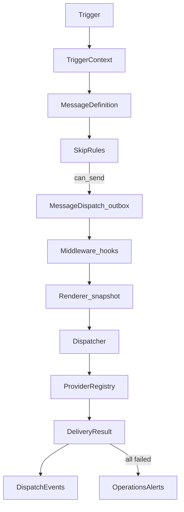

# ADR 0010: Messaging Orchestration Engine

## Status

**Accepted** (2026-07-24) — architecture freeze for Messaging Engine v1.

**Architecture freeze:** Messaging Engine **v1 core is complete** (Phases 1–8). There is **no Phase 9** of core engine development. No new top-level concepts (Event Bus, Kafka, plan DSL, UI plan editor, DB-driven plans, renderer plugins, BPMN / workflow engine). Further work is **Rollout** and **Adoption** only — see [Post-v1 work tracks](#post-v1-work-tracks-not-core-phases).

| Phase | Scope | Ships |
|-------|-------|-------|
| **1** | This ADR (normative contracts + ban on direct senders) | ✅ |
| **2** | `MessageDispatch` / `MessageDeliveryAttempt` / `MessageDispatchEvent` models + migrations | ✅ |
| **3** | Core engine (Trigger, Dispatcher, SkipRules, registry, startup validation) | ✅ |
| **4** | Booking / Email / WhatsApp provider adapters | ✅ |
| **5** | Scheduler + `TIME` materialization (`schedule_strategy`) | ✅ |
| **6** | `MESSAGE_ORCHESTRATION_*` flags + allowlists | ✅ |
| **7** | Live cutover: `CHECKIN_INFO`, `CHECKIN_LINK`, `WELCOME` | ✅ |
| **8** | PostGIS tests + `.env.example` + health wiring | ✅ |

---

## Summary

**Why:** Automated guest outbound (pre-arrival check-in nudges, WhatsApp welcome) grew as specialized senders (`GuestReminderService`, autocheckin tasks) with ad-hoc schedules and channel logic. New flows must not add more one-off sender paths.

**How:** A permanent **Messaging Orchestration Engine** — Trigger → MessageDefinition → `MessageDispatch` (outbox) → ProviderRegistry → DeliveryResult — with frozen snapshots, Property → Tenant → Platform schedule resolve, and auditable attempts.

**Normative rule (required):**

> **Messaging Engine is the only supported architecture for any new outbound communication feature. New communication flows must be implemented as Trigger → MessageDefinition → Dispatcher workflows; direct provider integrations are not permitted.**

Live v1 intents: **`CHECKIN_INFO`**, **`CHECKIN_LINK`**, **`WELCOME`** (WhatsApp). Manual compose, AI reply, invoice, portal, and other flows stay on the legacy path until **Adoption** migrates them onto this engine.

Package: `backend/apps/communications/messaging/`.

---

## Context / Problem statement

- Pre-arrival check-in reminders and day-of WhatsApp welcome are automated outbound today, but each path owns its own scheduling, channel selection, and idempotency.
- [ADR 0004](0004-guest-checkin-session.md) correctly keeps the session domain free of channels; reminders live in `communications` — but without a shared orchestration layer, every new automated message risks another specialized sender.
- Product needs Property → Tenant → Platform overrides for days/time/strategy — not `if tenant == …` branches.
- Ops needs auditability: who was targeted, which template/policy version, timezone at schedule time, fallback attempts with the same rendered body, and replay lineage.

Requirements:

- One outbox model for planned → delivered/failed/skipped/cancelled
- Render once; fallback must not re-render
- Fail-fast startup if definitions/providers/plans are misconfigured
- Rollout behind flags; rollback restores old reminder / autocheckin tasks

---

## Decision

### 1. Ban on direct senders for new flows

**Allowed for new automated outbound:** Trigger → MessageDefinition → Dispatcher → ProviderRegistry adapter.

**Forbidden for new flows:** calling Email/WhatsApp/Booking send primitives directly from Celery tasks, domain services, or views (except inside registered provider adapters).

**Parallel systems (v1, not migrated):**

| Path | Status |
|------|--------|
| Manual compose / reception reply | Legacy |
| AI reply | Legacy |
| Invoice / portal distribution | Legacy |
| `GuestReminderService` pre-arrival + old welcome task | Legacy parallel; **suppressed** for live allowlisted scope via `suppress_legacy_automated_outbound` (Phase 7) |

Provider adapters wrap **existing** send primitives; guest-visible behavior of Booking / Email / WhatsApp content is unchanged in v1 (including Meta WhatsApp welcome template copy).

### 2. Pipeline (normative)



`MessageDispatch` **is** the outbox (same pattern as `ChannexAriOutbox`). Timeline compatibility continues via `GuestMessageDraft` / `GuestOutboundMessage` writes from attempts.

### 2a. Team rule — dispatcher owns dispatch state

Informal but binding for review: **never mutate `MessageDispatch` / `MessageDeliveryAttempt` / `MessageDispatchEvent` state from a provider adapter.**

```text
Provider  →  DeliveryResult  →  Dispatcher  →  DB
```

Not:

```text
Provider  →  DB
```

Adapters may call existing send primitives (SMTP, Channex, Meta) and may create timeline rows (`GuestOutboundMessage` / draft) that the channel already owns — but **status transitions** on the outbox (`planned` → … → `delivered` / `failed` / `skipped`), attempt rows, and dispatch events are written **only** by the Dispatcher (or scheduler claim/expire/replay helpers). One authoritative state machine.

### 3. Core engine primitives

| # | Primitive | Role |
|---|-----------|------|
| 1 | **Trigger** | v1 kinds: `TIME`, `CRON`, `MANUAL`. Reserved for later: booking / payment / check-in / domain-event kinds as they appear |
| 2 | **TriggerContext** | Frozen dataclass; dispatcher must not inspect the caller |
| 3 | **MessageDefinition** | `template_version`, `channel_policy`, `skip_rules`, `audience`, `attachments=[]`, dedupe, expires, `delivery_window`, `retry_policy`, **`schedule_strategy`** |
| 4 | **SkipRule engine** | `can_send` only |
| 5 | **Template version + render snapshot** | Persist body/subject/language/`template_version`/`render_context`; **no re-render on fallback** |
| 6 | **DeliveryResult** | Success/failure + telemetry fields (section 4.F) |
| 7 | **ProviderRegistry** | Named providers + capabilities |
| 8 | **Correlation ID** | End-to-end trace across materialization and attempts |
| 9 | **Deduplication** | Prevent duplicate planned/queued dispatches per definition rules |
| 10 | **Scheduler lock** | Claim due rows with `SKIP LOCKED` |
| 11 | **Manual replay** | New dispatch with lineage + required reason |
| 12 | **Override hierarchy + metrics** | Property → Tenant → Platform; emit metrics |

ReminderPlan is **one** `TIME` trigger source; offsets, clocks, and strategy come from resolved schedule settings — not a DB-stored plan DSL.

### 4. Final pre-implementation contracts

#### A. `schedule_strategy`

Resolved with MessageDefinition / schedule settings (Property → Tenant → Platform):

| Strategy | Meaning | v1 use |
|----------|---------|--------|
| `FIXED_TIME` | Due at local date (check_in − days_before) @ send_time | Pre-arrival, WhatsApp welcome (default) |
| `FIRST_AFTER` | First scheduler tick on/after local send_time that day | Optional for pre-arrival |
| `IMMEDIATE` | `due_at = now` at materialization | Reserved for `BOOKING_CREATED` etc.; MANUAL replay may use |

#### B. Timezone snapshot (on `MessageDispatch` at create)

Do **not** recompute due time from live property timezone later:

- `due_at` (UTC)
- `timezone` (IANA string frozen at create)
- `local_due_at` (local datetime frozen at create)

#### C. `policy_version`

Frozen when channel policy is bound (e.g. hash or semver of ordered provider list + definition key). Audit shows which policy was used even if the registry changes later.

#### D. `render_checksum`

SHA-256 (or blake2) of normalized rendered body (+ subject). Dedupe hints, debug, and assertion that fallback attempts share the same content.

#### E. Recipient snapshot

Beyond `recipient_type`, persist resolved:

- `recipient_email`
- `recipient_phone`
- `recipient_booking_thread_id` (nullable)

Later guest contact changes must not rewrite dispatch history.

#### F. Attempt telemetry

On `MessageDeliveryAttempt`:

- `duration_ms`
- `error_category`: `NETWORK` \| `AUTH` \| `VALIDATION` \| `RATE_LIMIT` \| `PROVIDER` \| `UNKNOWN`
- plus `retryable`, `error_code`, `error_message`, `provider_message_id`

`DeliveryResult` must carry `error_category` + `duration_ms` (provider may omit duration; dispatcher fills wall clock).

#### G. Dispatcher middleware (interface only)

```python
before_dispatch(dispatch, ctx)
after_dispatch(dispatch, ctx, outcome)
```

No-op registry in v1; reserved for analytics / GDPR / A/B / billing without touching dispatcher core.

#### H. Startup validation (fail-fast)

On Django AppConfig / messaging bootstrap:

- Every MessageDefinition has renderer + `template_version` key present
- No duplicate definition keys / duplicate template versions
- Every ChannelPolicy provider is registered
- Plans reference known definitions
- Resolve chain is linear (property → tenant → platform); no self-reference bugs in config

Fail loud at worker/web startup.

#### I. Soft delete

Never hard-delete dispatches. Optional `archived_at` for retention UX; default keep forever in v1.

#### J. Lineage + replay reason

- `parent_dispatch_id` on replay / resend / follow-up
- `replay_reason`: `MANUAL` \| `PROVIDER_OUTAGE` \| `BUGFIX` \| `SUPPORT` (**required** on MANUAL replay)

### 5. Schedule settings (Property → Tenant → Platform)

| Key | Meaning | Platform default |
|-----|---------|------------------|
| `pre_arrival_days_before` | Days before check-in for INFO+LINK | `7` |
| `pre_arrival_send_time` | Local clock | `09:00` |
| `pre_arrival_schedule_strategy` | `FIXED_TIME` / `FIRST_AFTER` | `FIXED_TIME` |
| `whatsapp_welcome_days_before` / `whatsapp_welcome_send_time` / `whatsapp_welcome_schedule_strategy` | WELCOME (WhatsApp) schedule SoT | `0`, `11:15`, `FIXED_TIME` |

Resolve: property if not null → tenant if not null → platform.

v1 `TIME` materialization:

- Pre-arrival → `pre_arrival_*`
- WELCOME → `whatsapp_welcome_*` → platform only

Legacy `welcome_days_before` / `welcome_send_time` / `welcome_schedule_strategy` columns may still exist on Property / TenantReceptionSettings but are **unread** by the resolver and hidden from Django admin (soft remove). Column drop + optional data copy into empty `whatsapp_welcome_*` is **Korak 2** (deferred Adoption cleanup) — not part of Messaging Engine core.

Migrate `Property.whatsapp_autocheckin_time` → `whatsapp_welcome_send_time` (legacy bridge when WA send_time is null). Keep `whatsapp_autocheckin_enabled`.

Surfaces: Django admin + reception Automation settings API/UI (effective values + inherited hints). See [ADR 0008](0008-property-settings.md) automation section for the settings shell.

### 6. Models (outbox-first)

| Model | Role |
|-------|------|
| `MessageDispatch` | Identity, timing snapshots, status machine, policy/render/recipient snapshots, `fallback_used`, `archived_at` |
| `MessageDeliveryAttempt` | Provider/channel + DeliveryResult fields + FK to `GuestOutboundMessage` |
| `MessageDispatchEvent` | `DISPATCH_CREATED`, `RENDERED`, `CHANNEL_SELECTED`, `FALLBACK`, `DELIVERED`, `FAILED`, `CANCELLED`, `SKIPPED`, `REPLAYED` |

Status: `planned` → `queued` → `dispatching` → `delivered` \| `failed` \| `skipped` \| `cancelled`.

### 7. v1 live definitions

```text
PRE_ARRIVAL_INTENTS = ["CHECKIN_INFO", "CHECKIN_LINK"]
WELCOME_INTENTS = ["WELCOME"]
```

| Definition | Channels |
|------------|----------|
| `CHECKIN_INFO` | booking → email |
| `CHECKIN_LINK` | booking → email |
| `WELCOME` | whatsapp |

Content: short CHECKIN_INFO; CHECKIN_LINK includes session URL in `render_context`; WELCOME uses the existing Meta template.

Check-in session ownership remains [ADR 0004](0004-guest-checkin-session.md); the engine only distributes links / nudges.

### 8. Rollout flags

```text
MESSAGE_ORCHESTRATION_ENABLED=true|false
MESSAGE_ORCHESTRATION_SHADOW=true|false
MESSAGE_ORCHESTRATION_TENANTS=uzorita
MESSAGE_ORCHESTRATION_PROPERTIES=
OPERATIONS_ALERT_EMAILS=…
```

| Flag | Role |
|------|------|
| `ENABLED` | Master switch for Celery `communications.run_message_orchestration` |
| `SHADOW` | When true with allowlist: materialize planned outbox only (no provider send). Legacy senders stay active |
| `TENANTS` / `PROPERTIES` | Allowlists (fail-closed if both empty while enabled). Property tokens: `slug`, `tenant:slug`, or numeric id |

Decision helper: `apps.communications.messaging.flags` (`orchestration_decision`, `suppress_legacy_automated_outbound`).

**Phase 7 wiring:** when live + allowlisted, legacy paths skip automated outbound:

- `GuestReminderService.send_pre_arrival_reminder` (pre-arrival **and** D0 / `days_before=0`)
- `run_whatsapp_autocheckin_welcome` + intro email + `maybe_send_immediate_autocheckin_welcome`
- Management `send_whatsapp_autocheckin_welcome` (bypass with `--force`)

Engine WhatsApp provider still calls `send_welcome_template_for_reservation` (not gated). Align clocks: `manage.py align_messaging_schedules --tenant-slug uzorita` (welcome 0d @ 11:15; pre-arrival inherits platform 7d @ 09:00).

Rollback: flags off / shadow → old reminder + autocheckin tasks remain for all properties.

### 9. Interfaces reserved (stubs in v1)

| Item | v1 |
|------|-----|
| Middleware | Interface + no-op |
| RateLimiter | No-op |
| Attachments | `[]` typed |
| DeliveryWindow / DispatchPolicy | Channel-keyed quiet hours via `DispatchPolicy` (see below); stub `DeliveryWindow.allows` remains always-allow and must **not** map quiet hours to SKIP |
| DLQ | Retry-count threshold + metric (no UI) |
| `IMMEDIATE` / `FIRST_AFTER` | Enum + scheduler support; `IMMEDIATE` for MANUAL |

### 10. Health

Messaging health reports definitions, templates, providers (+ capabilities), plans, outbox depth (`planned`/`queued`), and last success/failure timestamps when available. Wired into reception `GET …/system/status/` as the top-level ``messaging`` block (`schema_version` ≥ 3).

### 11. Channel DispatchPolicy (quiet hours)

Business sendability is evaluated **per delivery channel** (not provider brand) via `DispatchPolicy.evaluate(dispatch, channel)` → `ALLOW` | `DEFER(until)` | `BLOCK`.

- **v1 `DeliveryWindowPolicy`:** WhatsApp quiet hours **21:00–08:00** property-local (`dispatch.timezone`). Booking and email always `ALLOW`.
- **DEFER:** bump `due_at` / `local_due_at` only; status stays **`planned`**. Emit non-terminal `MessageDispatchEventType.DEFERRED` with `reason`, `channel`, `next_attempt_at`, `timezone`. Claimer (`due_at <= now`) is the only wake-up — no sleep / secondary scheduler.
- Mid-chain defer (booking fail → email fail → WA quiet) is **not** `FAILED`.
- After reclaim, resume from WhatsApp — do not replay channels with prior failed attempts.
- `CHECKIN_INFO` / `CHECKIN_LINK` channel policy: `booking → email → whatsapp`. `WELCOME`: `whatsapp` only (same policy).

Implementation: `apps.communications.messaging.dispatch_policy`, wired in `dispatcher.dispatch_one`.

---

## Non-goals (v1)

- Migrating manual compose, AI reply, invoice, portal
- Reception UI for editing plans/policies/templates; DB-stored ReminderPlan DSL
- New providers (SMS, Push) beyond registry extensibility
- Full DLQ UI, RateLimiter enforcement
- Event Bus / Kafka / RabbitMQ / BPMN / workflow engine
- Changing Meta WhatsApp welcome template copy

---

## Consequences

### Positive

- One architecture for all future automated outbound; code review has a clear ban line
- Auditable snapshots (timezone, policy, recipient, checksum) survive settings and contact changes
- Allowlisted cutover with flag rollback
- Session domain (ADR 0004) stays channel-agnostic; engine owns distribution

### Negative

- Two systems in parallel until **Adoption** migrates legacy senders
- Startup fails hard on misconfiguration (intentional)
- Implementers must register definitions/providers/plans — no ad-hoc Celery send

---

## Post-v1 work tracks (not core phases)

After Phase 8 the engine is in **operational use**. Do not open a Phase 9 that reshapes the foundation. All further work belongs to one of two tracks.

### Rollout (operations)

Expand and harden live use of the **existing** v1 engine for already-migrated intents (`CHECKIN_INFO`, `CHECKIN_LINK`, `WELCOME`):

- Gradually widen `MESSAGE_ORCHESTRATION_TENANTS` / `MESSAGE_ORCHESTRATION_PROPERTIES`
- Monitor health (`GET …/system/status/` → `messaging`) and metrics (`messaging_metric`, ops alerts)
- Turn off legacy reminder / welcome paths only for scopes that are allowlisted, live (not shadow), and stable
- Keep rollback simple: shrink allowlist, set `SHADOW=true`, or `ENABLED=false`

Procedure: [messaging-orchestration-rollout-checklist.md](../../operations/messaging-orchestration-rollout-checklist.md).  
Track overview: [messaging-orchestration-post-v1.md](../../operations/messaging-orchestration-post-v1.md).

### Adoption (product on the same engine)

Migrate additional communication flows onto the **existing** Messaging Engine **without changing core architecture**:

| Flow | Approach |
|------|----------|
| Manual compose | Trigger `MANUAL` (or equivalent) → MessageDefinition → Dispatcher |
| AI reply | New definition + trigger; reuse providers |
| Portal notifications | Definition + channel policy; no parallel sender |
| Invoice | Definition + email (etc.) provider |
| Review request / other lifecycle | Reserved triggers as domain events appear |

Rules for Adoption PRs:

1. Reuse Trigger → MessageDefinition → Dispatcher; add definitions / skip rules / providers as needed  
2. **No new parallel sender stacks** and no direct provider calls outside adapters  
3. Delete a specialized sender only after allowlisted cutover is proven (same Rollout discipline)  
4. Core package contracts (outbox, snapshots, DeliveryResult, registry) stay frozen unless a separate ADR amends 0010

---

## Alternatives considered

| Approach | Why rejected |
|----------|--------------|
| Reminder-only MVP without engine | Would force a second migration when the next automated message appears |
| Big-bang migrate all senders | Too much risk; timeline/compose/AI/invoice stay parallel in v1 |
| DB-driven plan DSL / UI plan editor | Out of freeze; ReminderPlan stays code + settings-backed |
| Event Bus / Kafka as first-class | Premature; Celery + outbox is enough for v1 |
| Tenant `if` branches for schedules | Forbidden; Property → Tenant → Platform resolve only |

---

## References

- Plan: Messaging Engine Foundation (platform MVP) — Phases 1–8 closed; post-v1 = Rollout + Adoption
- Post-v1 tracks: [messaging-orchestration-post-v1.md](../../operations/messaging-orchestration-post-v1.md)
- Ops rollout (LIVE cutover): [messaging-orchestration-rollout-checklist.md](../../operations/messaging-orchestration-rollout-checklist.md)
- [ADR 0004 — Guest web check-in session](0004-guest-checkin-session.md) — session SoT; engine distributes CHECKIN_* / WELCOME
- [ADR 0008 — Property settings](0008-property-settings.md) — automation settings shell for schedule keys
- [ADR 0019 — Conversation store, provider ingest and delivery](0019-messaging-conversation-store.md) — inbox/timeline/read model; engine is a producer into that store, not the inbox
- Outbox precedent: `ChannexAriOutbox` (`backend/apps/integrations/models.py`)
- Package (implementation): `backend/apps/communications/messaging/`
